# 🛍️ GoShopora – ECommerce Android App

GoShopora is a modern, scalable eCommerce Android application built using Kotlin and Jetpack Compose, designed with clean architecture principles and real-time data handling. It delivers a smooth shopping experience with both online and offline capabilities.

## 🚀 Key Features
- 🧭 Modern UI with Jetpack Compose
- 🔐 User Authentication using Firebase Authentication
- ☁️ Real-time Data Sync with Firebase Firestore
- 🛒 Offline Cart System using Room Database
- 🔎 Search Functionality for products
- 📂 Category-based Product Filtering
- 🔄 Seamless Navigation across 8+ screens
- ⚡ Asynchronous Operations using Kotlin Coroutines
- 🖼️ Optimized Image Loading with Coil

## 🏗️ Architecture

The app follows MVVM (Model-View-ViewModel) architecture for better separation of concerns and maintainability.

- View → Jetpack Compose UI
- ViewModel → Handles UI logic and state
- Model → Data layer (Firebase + Room)
## 🛠️ Tech Stack
- Language: Kotlin
- UI: Jetpack Compose
- Architecture: MVVM
- Dependency Injection: Hilt
- Database (Offline): Room
- Backend Services: Firebase Authentication & Firestore
- Async Handling: Kotlin Coroutines
- Image Loading: Coil
- Navigation: Jetpack Navigation Component

## Screens
- Home Screen
- Product Listing
- Product Details
- Cart (Offline)
- Search Screen
- Category Filtering
- Login / Signup
- Profile
## 📦 Key Implementations
#### 🔐 Authentication
- Firebase Authentication for secure login/signup
#### ☁️ Real-time Database
- Firestore used for fetching and syncing product data
#### 🛒 Offline Cart
- Room Database ensures cart functionality without internet
#### 🔄 State Management
- Managed using ViewModel + Compose state APIs
#### ⚡ Performance Optimization
- Coroutines for non-blocking operations
- Coil for fast image rendering
## 📈 Future Enhancements
- Payment Gateway Integration 💳
- Order Tracking 📦
- Push Notifications 🔔
- Admin Panel
## Contributing

Contributions are always welcome!

Feel free to fork the project and submit pull requests!

## Authors

- [@letsgoaditya](https://github.com/letsgoaditya)

## Feedback

If you have any feedback, please reach out to me at adityarana65@gmail.com

  Made with ❤️ by Aditya Rana

## 📸 Screenshots

### 🔐 Authentication

  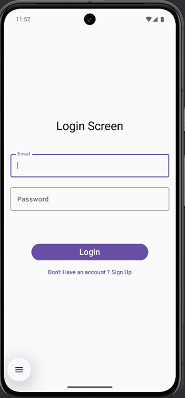
  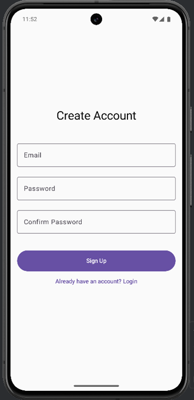
  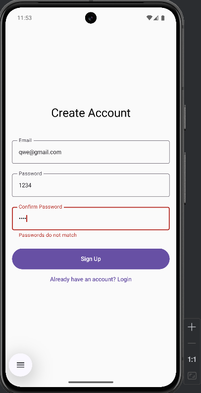

### 🏠 Home & Categories

  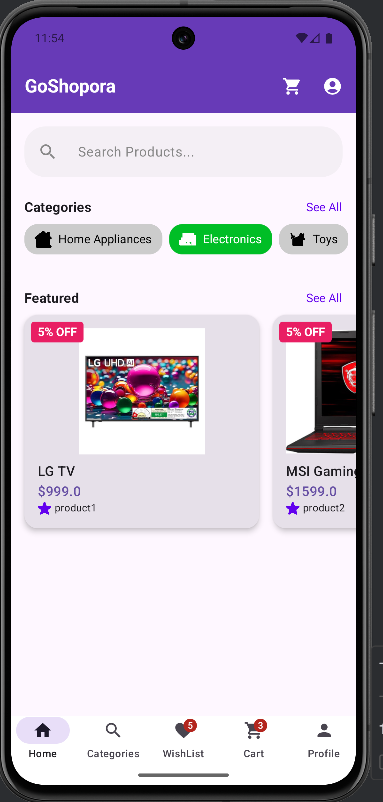
  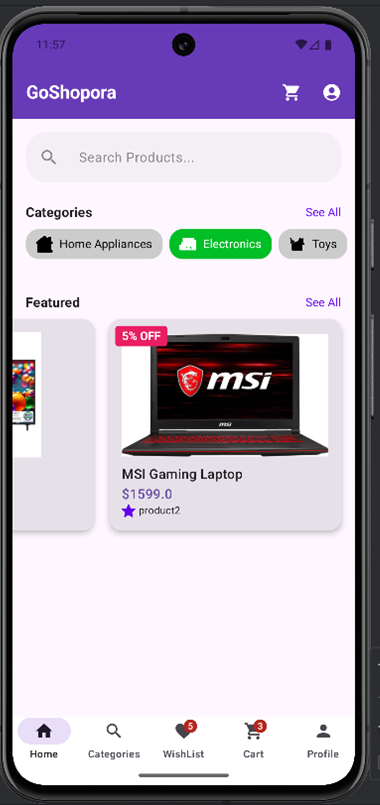
  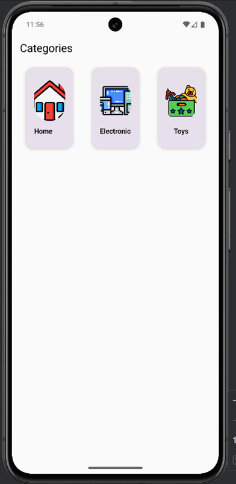

### 📦 Products

  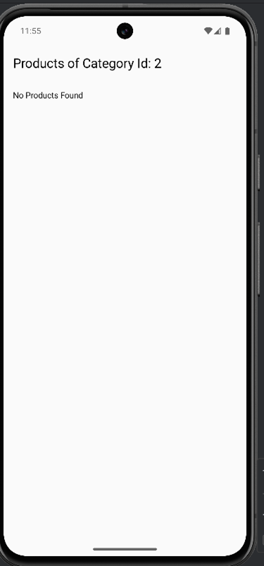
  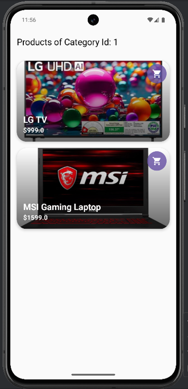

  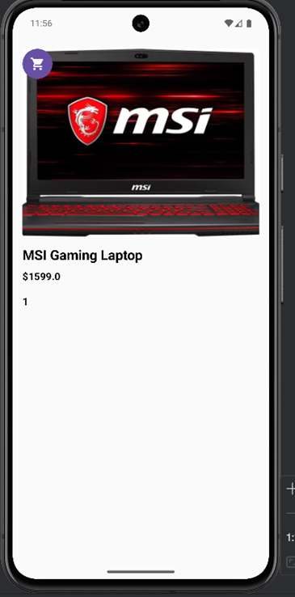
  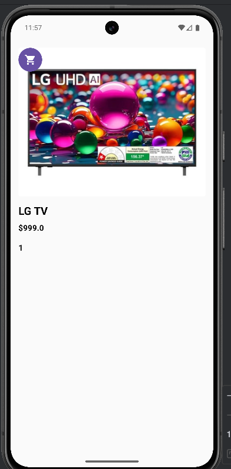

### 🔍 Search

  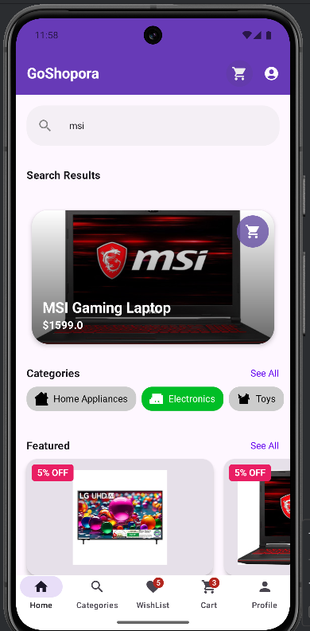
  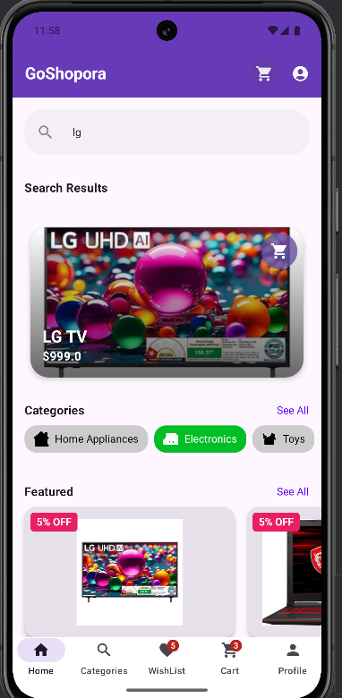

### 🛒 Cart

  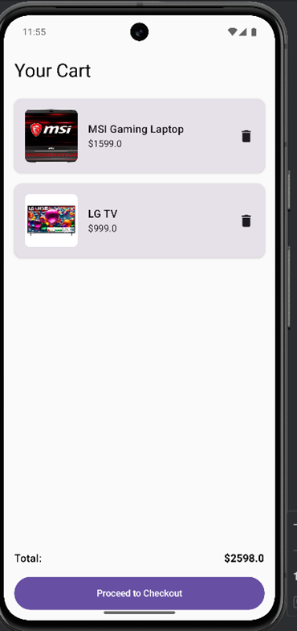
  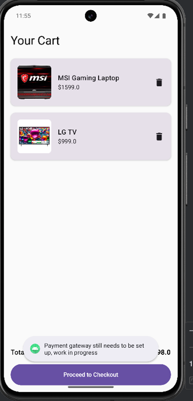
  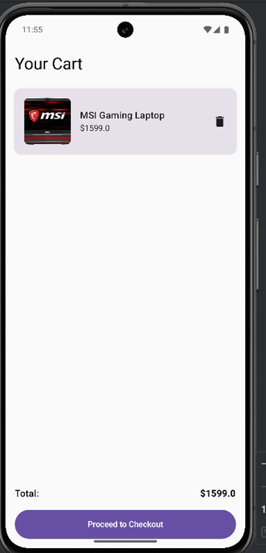

### 👤 Profile

  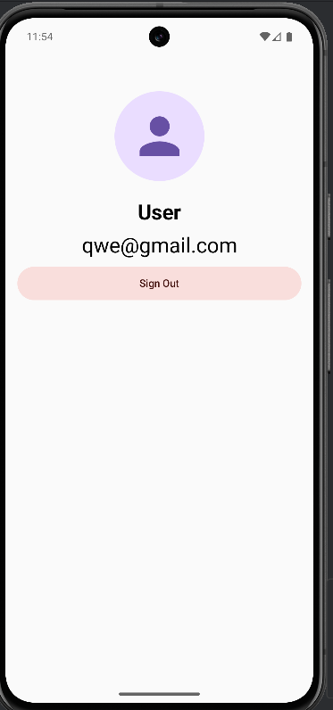

### 🔥 Firebase / Backend

  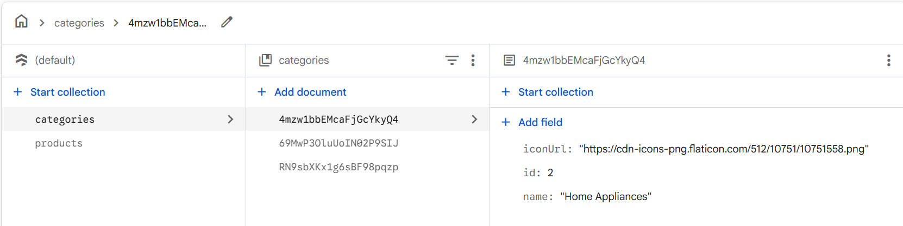
  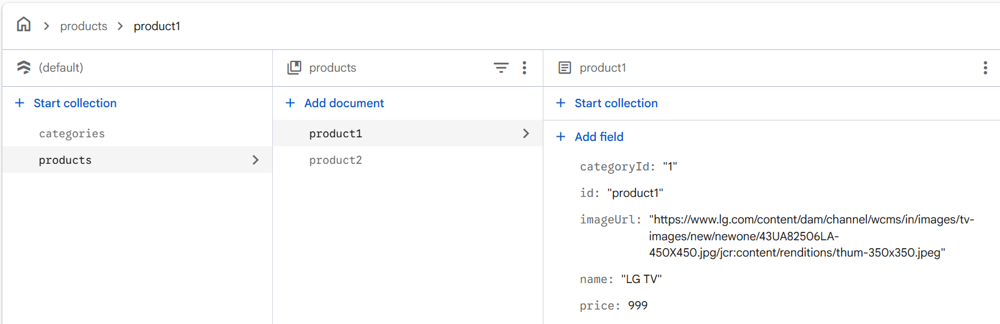
  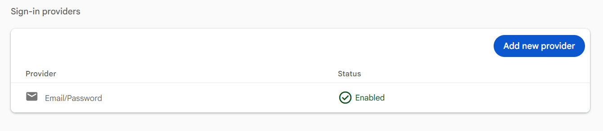

 

# ⚠️ Setup Notes

> Please complete the following steps before running the project:

---

### 🔑 Firebase Configuration

- Set up your project in the **Firebase Console**
- Download the `google-services.json` file
- Place it inside the project directory:app/google-services.json

- Ensure the file name is exactly **`google-services.json`** (do not rename)

---

### ☁️ Firestore Database Setup

- Configure **Firebase Firestore** according to the project structure
- Refer to the screenshots provided in this repository for guidance

---

### 🔐 Authentication Setup

- Enable **Email/Password Authentication** in the Firebase Console
- Required for login and signup functionality

---

## 💡 Important Note

- The `google-services.json` file is **not included** in this repository for security reasons so it is added to my `.gitignore` file to prevent accidental exposure
